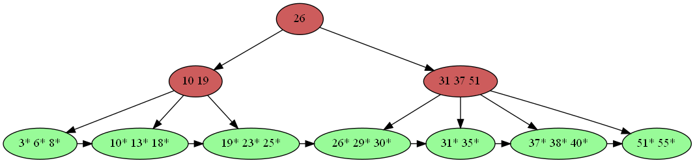
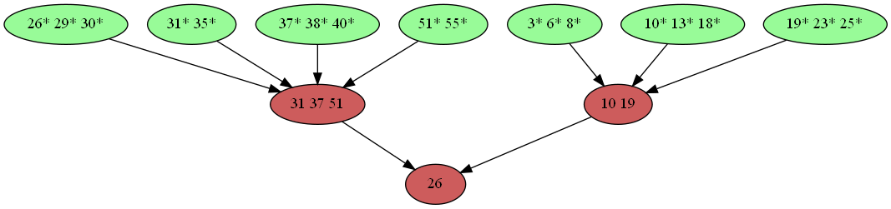

# C++ implementation of B+Tree
- Reference
    - Book *Database System Concepts 7th Edition-2019*
    - [CMU 15.445 2017](https://15445.courses.cs.cmu.edu/fall2017//assignments.html)
- API
    - [x] Insert
    - [x] Lookup
    - [ ] Delete
- Test results
```
[==========] Running 4 tests from 1 test case.
[----------] Global test environment set-up.
[----------] 4 tests from BPlusTree
[ RUN      ] BPlusTree.KeyComparatorTest
[       OK ] BPlusTree.KeyComparatorTest (0 ms)
[ RUN      ] BPlusTree.SimpleTest
dumping B+Tree to dot files "test1_1.dot", "test1_2"...
[       OK ] BPlusTree.SimpleTest (7 ms)
[ RUN      ] BPlusTree.SimpleTest2
number of kv inserted: 1000
dumping B+Tree to dot files "test2_1.dot", "test2_2"...
[       OK ] BPlusTree.SimpleTest2 (7746 ms)
[ RUN      ] BPlusTree.Compare1
stl map INSERT test begins...
stl map INSERT test ends: 0.485
B+Tree INSERT test begins...
B+Tree INSERT test ends: 5.516
stl map FIND test begins...
stl map FIND test ends: 0.483
B+Tree FIND test begins...
B+Tree FIND test ends: 4.013
[       OK ] BPlusTree.Compare1 (10535 ms)
[----------] 4 tests from BPlusTree (18292 ms total)

[----------] Global test environment tear-down
[==========] 4 tests from 1 test case ran. (18295 ms total)
[  PASSED  ] 4 tests.
```
- Using *dot* to visualize. Here is an example:



In order to validate the *parent* pointer of each node, another picture is drawn as follow:

